# Applied Machine Learning — Summer 2026

**Task 1:** sentiment classification of movie-review snippets contaminated with spam email.
**Task 2:** 5-point face-landmark alignment. All experiments ran on an Apple M4 Mac Mini, deep
models on PyTorch/MPS. Every number and figure below comes from the code in this archive, whose
`tests_sanity.py` files verify the mechanics behind them.

---

## Task 1 — Sentiment analysis

### 1.1 The problem

The training set is 11,503 documents labelled 0 (negative) or 1 (positive), but roughly a
quarter are not reviews: they are Enron-style emails injected as spam. The brief requires spam in
the test set to get a label that is neither 0 nor 1, so this is a three-way problem with labels
for only two classes; I use −1 as the dummy.

That shapes the architecture (Figure 1). Rather than asking one classifier to learn "spam" from
labels that never mark it, two decoupled stages: an unsupervised structural gate deciding
*whether this is a review*, and a sentiment model that only sees what survives it. They share no
features, so a failure in one cannot corrupt the other.

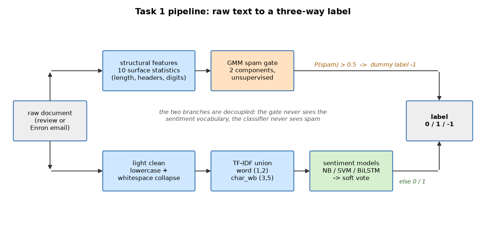

*Figure 1: Task 1 pipeline. The upper branch decides genre from surface structure, the lower
sentiment from lexical content; they are deliberately disjoint.*{: .caption }

### 1.2 Preprocessing and representation

**Spam gate.** Ten surface statistics per document (`src/structure_features.py`): log length,
line-break, digit, non-alphanumeric and uppercase ratios, mean token length, and binary flags for
RFC-822 headers, URLs and email addresses. These are genre cues, not topic cues — deliberately,
because a gate built on vocabulary stops working the moment the spam changes subject. A
two-component Gaussian mixture is fitted to the standardised features with no labels at all.

**Sentiment.** A union of word (1–2 gram) and character (`char_wb`, 3–5 gram) TF-IDF, sublinear
term frequency, `min_df=3`. Character n-grams matter because the snippets are short and noisy,
capturing *wasn't*, sub-word affixes and typos without stemming.

My hypothesis was that with character n-grams present, hand-engineered preprocessing would be
redundant. Table 1 tests it with the classifier fixed, so each cell isolates one decision.

| Preprocessing | word (1,2) | char (3,5) | word + char |
|---|---|---|---|
| lowercase only | 0.741 | 0.749 | 0.758 |
| + stopword removal | 0.767 | 0.750 | 0.758 |
| + lemmatisation | 0.743 | 0.765 | 0.767 |
| + negation marking | 0.770 | 0.769 | **0.780** |

*Table 1: Preprocessing × representation ablation, validation accuracy on genuine reviews.*{: .caption }

Half the hypothesis survived. Stopword removal and lemmatisation buy nothing once character
n-grams are present — lemmatisation even *costs* the word-only model accuracy, destroying the
distinctions separating *disappoints* from *disappointed*. Negation marking is the exception,
adding 2.2 points: character n-grams see that a negator is *present* but not what it applies to,
and a bag of n-grams cannot represent scope. I adopted it as the deployed preprocessor — a
decision made by measurement, against my prior.

### 1.3 Prediction methods

Supervised binary classification with a routed third label. Four models spanning different
inductive biases:

1. **Word-list classifier** — the interpretable floor: the 400 words most over-represented in
   each class by document frequency, predicting positive when positive hits exceed negative.
2. **Multinomial naive Bayes** on the TF-IDF union (α = 0.3). Generative, closed-form.
3. **Calibrated linear SVM** (`LinearSVC`, C = 1, `class_weight="balanced"`) on the same union.
   Hinge loss, max-margin; Platt scaling (sigmoid, 3-fold) supplies the routing probabilities.
4. **BiLSTM over pretrained GloVe embeddings** (Figure 2) — the structurally different second
   method. Every model above is a bag of substrings that cannot represent word order, yet the
   mined failures are overwhelmingly compositional. Token ids padded to 60, frozen GloVe-100d
   table (90.4% coverage), one bidirectional LSTM layer of 128 units per direction, max-over-time
   pooling, dropout 0.4, cross-entropy loss, Adam 1e-3.

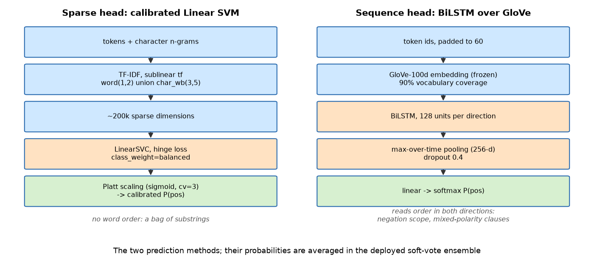

*Figure 2: The two prediction heads, whose probabilities are averaged in the deployed system.*{: .caption }

**Hyperparameters, and why.** Embeddings frozen: 8.5k short sentences cannot re-estimate
400k × 100 parameters without memorising them, and freezing preserves the geometry GloVe learned
from 6B tokens. One layer, not two — the sentences average 21 tokens, so depth adds capacity
where there is no signal to fit. Max-over-time pooling rather than the final hidden state, so a
decisive clause anywhere can carry the prediction. Vocabulary pruning is switched *off*
(`min_count=1`, worth 1.5 points) because GloVe already supplies a good vector for a word seen
once. Early stopping runs against a 10% slice held out of the *training* set, never validation —
otherwise the BiLSTM row would be selected on the data it is scored on.

### 1.4 Quantitative results

| Model | Val. accuracy | Val. F1 | Train time (s) |
|---|---|---|---|
| **Soft-vote ensemble** | **0.811** | **0.805** | 49.1 |
| Calibrated linear SVM | 0.790 | 0.792 | 1.2 |
| Multinomial naive Bayes | 0.779 | 0.776 | 0.8 |
| BiLSTM + GloVe | 0.774 | 0.764 | 47.1 |
| Word-list floor | 0.603 | 0.695 | 0.05 |

*Table 2: Validation accuracy on the 1,066 genuine reviews. Wall-clock on the M4.*{: .caption }

The BiLSTM does **not** beat the sparse models alone: a sequence model is the wrong shape for
8.5k single-sentence examples where lexical cues carry most of the signal. All three non-trivial
models land within 1.6 points of each other, suggesting a data ceiling rather than a modelling
failure — Section 1.5 shows label noise consistent with that.

What it *does* provide is decorrelated errors, being the only member that can see word order.
Averaging the three calibrated probability vectors — free, since nothing is refitted — reaches
0.811, beating every member by 2.1 points. That is the payoff for a second method, and it exists
only because the method was structurally different rather than another linear model on the same
features.

Including spam routing, three-way validation accuracy is **0.856**. Figure 3 shows the spam
class perfectly separated (331/331, no leakage either way) and residual sentiment errors
near-symmetric: 82 positives called negative against 119 the reverse.

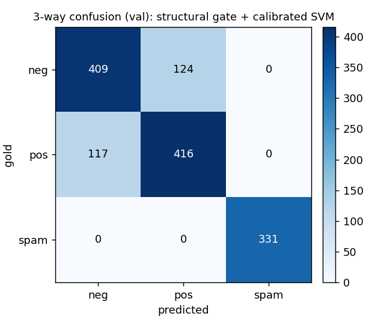

*Figure 3: Three-way validation confusion matrix, deployed system.*{: .caption }

### 1.5 Qualitative analysis

The 12 highest-confidence errors are in `results/failure_cases.csv`; four patterns explain
nearly all of them.

> *"a lightweight, uneven action comedy that freely mingles french, japanese and hollywood
> cultures."* — gold 0, predicted 1 at 0.96.

**Damning with faint praise.** Every content word is neutral-to-positive; the negative verdict
rests entirely on *lightweight* and *uneven*. The model cannot represent understatement.

> *"neither the funniest film eddie murphy nor robert de niro has ever made, showtime is
> nevertheless efficiently amusing."* — gold 1, predicted 0.

**Mixed polarity with a concessive pivot.** Negative for two-thirds of its length, reversing on
*nevertheless*. A bag of n-grams sums both halves and the negative half is longer; negation
marking cannot help, the reversal being discourse-level, not syntactic.

> *"you're never quite sure where self-promotion ends and the truth begins. but ... you're too
> interested to care."* — gold 1, predicted 0.

**Negation of a negative.** Both phrases are positive in effect and negative in surface form —
exactly the compositional case the BiLSTM was added for, and here it is right where the SVM is
wrong.

> *"idiotic and ugly."* — gold **1**, predicted 0 at 0.92 confidence.

**Label noise.** Not a model failure. Several such items exist, placing a hard ceiling on
achievable accuracy and explaining the ~0.79 plateau.

### 1.6 Auditing the spam gate

The gate scores precision = recall = F1 = 1.000 against a high-precision RFC-822 header rule.
That is close to circular: both read document structure, so their agreement is not independent
evidence. Two things that *are*:

**A hand audit.** 50 randomly sampled gated documents, checked against evidence the gate cannot
see — business and email *vocabulary*, where every gate feature is a surface statistic with no
access to the lexicon. 44 of 50 (88%) contain it; the other six are short forwarded fragments
with no distinctive words either way, not misfires on reviews. The sample is in
`results/spam_gate_audit.csv` with excerpts, so the claim can be checked rather than trusted.

**A zero false-positive rate out of domain.** Over NLTK `movie_reviews` — genuine reviews, no
spam, far longer than anything in training — the gate fires **0 times in 2,000**. Since length is
its strongest feature, that is the sharpest available test of its false-positive mode.

### 1.7 External generalisation

On NLTK `movie_reviews` (2,000 full-length critiques) the deployed system scores **0.739**
against 0.811 in domain. The shape of the loss is the interesting part: recall is 0.979 on the
negative class but 0.498 on the positive — a near-unanimous negative predictor.

This is a length/domain shift, not a defect in the model (Figure 4). Training documents average
21 words; NLTK documents average 746. A long document accumulates far more weighted terms, and
because the training vocabulary's discriminative mass skews negative, the score drifts down with
length: mean P(positive) falls from 0.491 to 0.333, declining across length deciles and crossing
below the 0.5 threshold. What moved is the operating point, not the discrimination; recalibrating
would recover much of the gap but needs target labels.

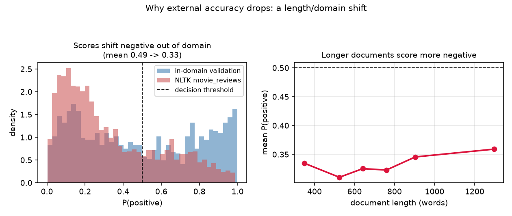

*Figure 4: Scores shift negative out of domain (left) and fall with document length (right),
explaining the asymmetric recall in Figure 5.*{: .caption }

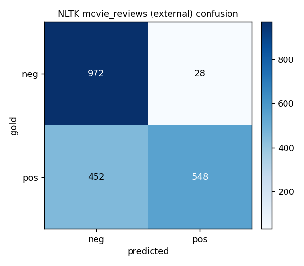

*Figure 5: NLTK `movie_reviews` confusion — the negative-class bias made concrete.*{: .caption }

### 1.8 Test predictions

Written by the worksheet's `save_as_csv`, copied verbatim into `src/submission.py`: no header,
1,434 rows, test-set order untouched. The distribution is 564 negative, 502 positive and 368
spam-dummy (−1), consistent with the 25.8% spam rate seen in training.

---

## Task 2 — Face alignment

### 2.1 Preprocessing and representation

2,600 training images, 211 validation and 554 test: 256×256 RGB with five landmarks (eyes, nose,
mouth corners). Preprocessing: RGB→greyscale (landmark cues are structural, not chromatic),
resize to 64×64 with `INTER_AREA`, intensity to [0,1]. The detail that matters is that landmarks
are multiplied by the same (sx, sy) as the image and inverted again before submission;
`tests_sanity.py` asserts that round trip is exact. CLAHE equalisation is implemented but left
off — it amplifies noise in the dark frames, of which this set has several.

Two representations follow, one per model family: a global HOG descriptor (6×6 cells, 3×3 block
L2-Hys normalisation, 9 orientations), and the raw 64×64 intensity map for the CNN.

### 2.2 Prediction methods

Supervised regression to ten continuous coordinates. Three approaches plus a floor:

1. **Mean face** — the training mean shape for every image. The honest floor.
2. **PCA shape model + HOG ridge regression.** PCA on the 10-D landmark vectors gives a mean
   shape plus 6 modes explaining 97.7% of shape variance; ridge regression maps the HOG
   descriptor to those shape *parameters* rather than raw coordinates, constraining predictions
   to the manifold of plausible faces — the model cannot output a geometrically impossible one.
   Loss: squared error with L2 penalty (α = 1), closed form.
3. **Heatmap-regression CNN with a soft-argmax decode** (Figure 6) — the headline model. Rather
   than emitting ten numbers from a dense head it predicts one 64×64 Gaussian heatmap per
   landmark, decoded by spatial expectation; arg-max is not differentiable, which is what
   heatmap targets and soft-argmax exist to solve. Loss: pixel-wise MSE against the targets plus
   0.1 × MSE on the decoded coordinates. Trained twice, with and without augmentation, because
   the difference is the robustness argument.

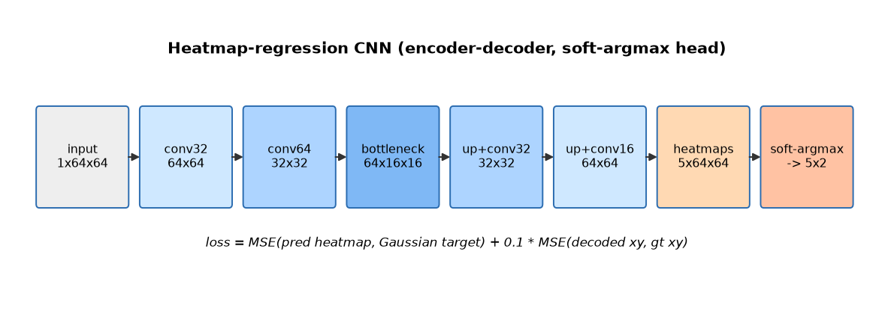

*Figure 6: Encoder–decoder heatmap CNN, 100,309 parameters. The 16×16 bottleneck supplies the
receptive field to place a landmark from global context; the decoder restores resolution.*{: .caption }

**Hyperparameters, and why.** σ = 1.5 px makes each target blob ~7 px across: wide enough to
give gradient everywhere near the landmark, tight enough that the expectation is not dragged by a
neighbouring blob. The coordinate term is weighted 0.1 in *grid-relative* units — in raw pixels
it starts near 10³ against a heatmap MSE of 10⁻², so no weighting keeps the heatmap term relevant
and the model degenerates into the direct regressor this design replaces; targets peak at 1.0
rather than summing to 1 for the same reason. Adam at 1e-3 with cosine annealing, batch 32.
Training stops early on validation **AUC-CED**, not training loss, which is dominated by the
heatmap term and improves after the decoded coordinates have stopped. Augmentation (flip with the
mandatory 0↔1, 3↔4 index swap; ±25° rotation; 0.85–1.15 scale; ±8% translation; photometric
jitter and noise) expands training 4×; test-time augmentation averages a flipped pass.

**Compute.** Apple M4 Mac Mini, PyTorch MPS. Shape model 1.2 s on CPU; CNN without augmentation
3.5 min (early-stopped at epoch 76, best 51), with augmentation 9.1 min (stopped at 50, best 25)
— fewer epochs because each shows it four times the data.

### 2.3 Quantitative results

Two metrics, answering different questions. The **raw Euclidean pixel error at 256×256**, from
the worksheet's `euclid_dist`, is what the graders measure. The **inter-ocular-normalised
error** — the same distance over the eye-to-eye distance — is scale-invariant and so the fair
basis for comparison; AUC-CED is its area under the CED up to 0.10.

| Approach | Mean px | Median px | AUC-CED | ≤5 px | ≤8 px | ≤12 px |
|---|---|---|---|---|---|---|
| Mean face (floor) | 12.12 | 10.48 | 0.182 | 4.3% | 21.8% | 51.2% |
| PCA shape + HOG ridge | 6.20 | 5.36 | 0.418 | 34.1% | 79.6% | 98.1% |
| Heatmap CNN, no augmentation | 7.73 | 4.69 | 0.452 | 41.7% | 69.2% | 83.4% |
| **Heatmap CNN, augmented** | **5.59** | **4.45** | **0.512** | **57.3%** | **86.7%** | **96.2%** |

*Table 3: Validation results (n = 211). Percentages are the fraction of images whose mean
per-landmark error is below the threshold — the graded quantity.*{: .caption }

The threshold columns are why selection uses them rather than the mean. The non-augmented CNN
has a **better** median than the shape model (4.69 vs 5.36 px) but a **worse** mean (7.73 vs
6.20) — a fat tail of failures dragging the average. It wins at 5 px yet loses at 8 px (69.2% vs
79.6%). Only the augmented CNN wins on every column, so it is deployed.

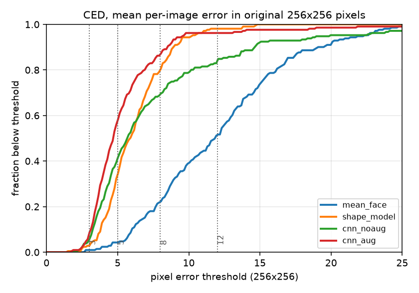

*Figure 7: CED in original-resolution pixels, graded thresholds marked. The crossing curves are
the fat tail made visible.*{: .caption }

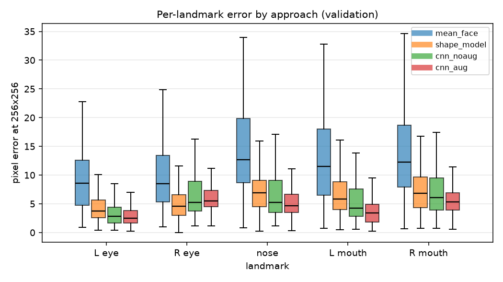

*Figure 8: Per-landmark error.*{: .caption }

For the deployed model the left eye is most accurate (3.89 px) and the right least (7.13 px),
mouth corners between (4.58 and 6.36 px). The asymmetry is a dataset property, not an artefact:
here the "right" eye is more often the far eye under yaw, so more often foreshortened or
occluded — which Section 2.4 confirms.

### 2.4 Qualitative results

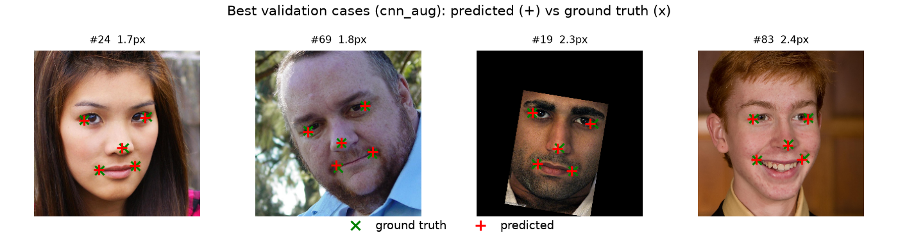

*Figure 9: Best four cases (1.7–2.4 px): frontal, evenly lit, unoccluded.*{: .caption }

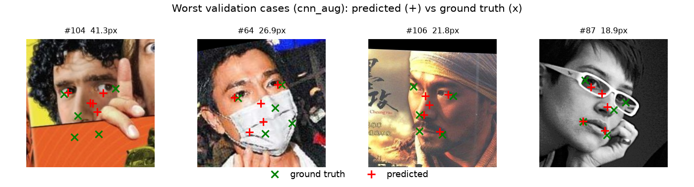

*Figure 10: Worst four cases (18.9–41.3 px), each a different failure mode.*{: .caption }

The failures are not random; each has a nameable cause. #104: a hand occludes the lower face, so
the mouth landmarks are placed by shape prior alone and land on the hand. #64: a surgical mask
removes every mouth cue and the model puts the corners on the mask's edge, the strongest
remaining contour. #106: a stylised film poster, not a photograph, with intensity statistics
outside the training distribution. #87: near-profile behind heavy glasses.

Occlusion and out-of-distribution imagery dominate, and **the systematic bias is yaw**.
Correlating per-image error against pose proxies read off the ground truth gives r = **+0.37**
against |yaw| but only **+0.10** against |roll| (Figure 11). That asymmetry is itself evidence
the augmentation worked: rotation augmentation covers roll, so roll costs almost nothing, while
nothing in the set synthesises out-of-plane rotation, so yaw remains uncorrected. Fixing it needs
3-D-aware augmentation or yaw-stratified sampling — neither available from a 2-D affine warp.

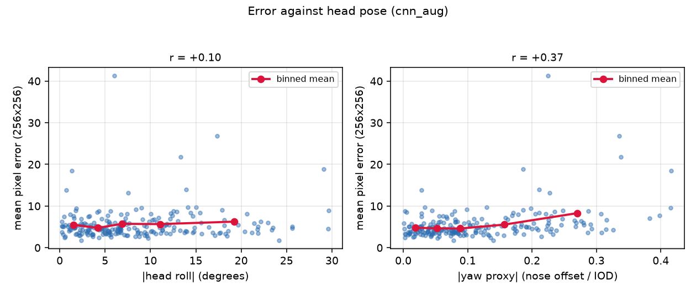

*Figure 11: Error against head pose: roll is flat, yaw is not.*{: .caption }

### 2.5 Robustness

Both CNNs were stressed under increasing corruption, with the ground truth transformed
identically in the geometric case (Figure 12).

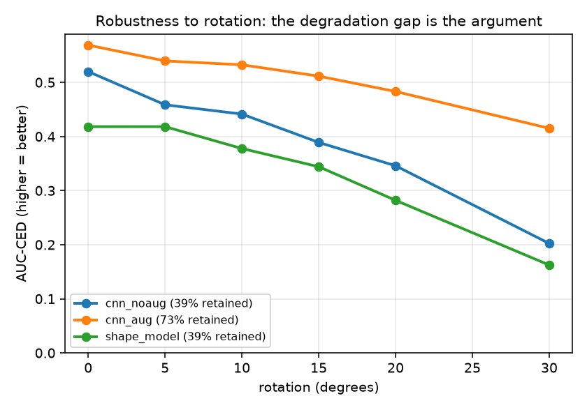

*Figure 12: Robustness to rotation; the gap between the CNNs is the augmentation effect.*{: .caption }

**Rotation.** The augmented model retains 73% of its AUC-CED at 30° (0.569→0.415); the
non-augmented one retains 39% (0.520→0.202), so the augmented model at 30° still beats the
non-augmented one *undisturbed*. This is the clean demonstration that augmentation teaches the
transformation rather than merely regularising: the network saw rotated faces with correctly
rotated targets, so what it learned is approximately equivariant. The shape model degrades
faster than either (0.418→0.162) despite HOG's small-rotation tolerance — its PCA basis was
fitted on upright faces, so a rotated face is off the shape manifold however stable the
descriptor.

**Noise.** The ordering reverses, which is the more interesting result. Both CNNs collapse by
σ = 0.10 (to 0.030 and 0.013) while the shape model retains 45% of its AUC-CED at σ = 0.20.
HOG's block-wise contrast normalisation divides out precisely the perturbation noise introduces;
the CNN's first convolution passes it straight through. The augmented CNN beats the
non-augmented one at every noise level (0.268 vs 0.148 at σ = 0.05), but its training-time noise
was σ = 0.02, so that advantage does not extrapolate. Heatmap regression buys *geometric*
robustness, not photometric — a deployment facing sensor noise should train with matched noise
or keep the classical model as a fallback.

### 2.6 Test predictions

The deployed model was run over all 554 test images in the given order, scaled back to 256×256
and written by the worksheet's `save_as_csv` verbatim. All coordinates lie in [62.3, 196.8] —
inside the frame, confirming the inverse scaling ran. Figure 13 is the pre-shipping check.

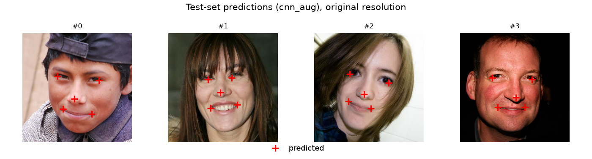

*Figure 13: First four test images with predicted landmarks at original resolution.*{: .caption }

---

## Use of generative AI

Generative AI (Claude) was used as a coding assistant: scaffolding plotting code, suggesting
refactors, and drafting prose that I then edited. All modelling decisions, hyperparameter
justifications, experimental design and analysis are my own, and every number reported here was
produced by running the code in this archive.

## References

Cootes, T., Taylor, C., Cooper, D. and Graham, J. (1995) 'Active shape models — their training
and application', *Computer Vision and Image Understanding*, 61(1), pp. 38–59.

Dalal, N. and Triggs, B. (2005) 'Histograms of oriented gradients for human detection',
*CVPR*, pp. 886–893.

Das, S. and Chen, M. (2001) 'Yahoo! for Amazon: extracting market sentiment from stock message
boards', *Asia Pacific Finance Association Annual Conference*.

Newell, A., Yang, K. and Deng, J. (2016) 'Stacked hourglass networks for human pose
estimation', *ECCV*, pp. 483–499.

Pang, B., Lee, L. and Vaithyanathan, S. (2002) 'Thumbs up? Sentiment classification using
machine learning techniques', *EMNLP*, pp. 79–86.

Pedregosa, F. et al. (2011) 'Scikit-learn: machine learning in Python', *Journal of Machine
Learning Research*, 12, pp. 2825–2830.

Pennington, J., Socher, R. and Manning, C. (2014) 'GloVe: global vectors for word
representation', *EMNLP*, pp. 1532–1543.

Platt, J. (1999) 'Probabilistic outputs for support vector machines and comparisons to
regularized likelihood methods', *Advances in Large Margin Classifiers*, pp. 61–74.

Salton, G. and Buckley, C. (1988) 'Term-weighting approaches in automatic text retrieval',
*Information Processing & Management*, 24(5), pp. 513–523.

Sun, X., Xiao, B., Wei, F., Liang, S. and Wei, Y. (2018) 'Integral human pose regression',
*ECCV*, pp. 529–545.

Tompson, J., Jain, A., LeCun, Y. and Bregler, C. (2014) 'Joint training of a convolutional
network and a graphical model for human pose estimation', *NeurIPS*, pp. 1799–1807.

Zhang, Z., Luo, P., Loy, C. C. and Tang, X. (2014) 'Facial landmark detection by deep
multi-task learning', *ECCV*, pp. 94–108.

University of Sussex (2026) *Applied Machine Learning*, lecture slides W06_L12 (image
preprocessing), W09_L17 (HOG features), W09_L18 (landmark regression and augmentation),
W10_L20 (data augmentation), W11_L21 (encoder–decoder architectures).
